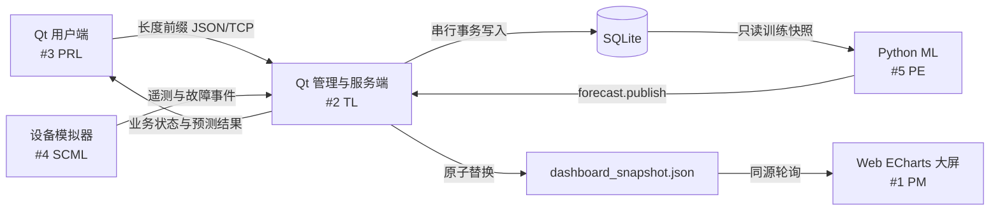

# 电动汽车充电桩应用管理平台设计说明

> **历史 v1 基线（2026-09-01）：** 本文记录当时的五系统硬门槛和设计事实；该硬门槛已被 [2026-09-04 核心交付范围重置设计](../superpowers/specs/2026-09-04-core-scope-rebaseline-design.md)替代。正文不据此回写，以保留决策与实施历史证据；当前执行口径以范围重置设计、范围基线和核心发布计划为准。

> 状态：已确认  
> 设计日期：2026-09-01  
> 最终截止：2026-09-10  
> 原始需求：`references/01.项目说明书-东软电动汽车充电桩应用管理平台.doc`

## 1. 项目背景与约束

本项目由 5 名学生全日投入，在 9 月 10 日前交付并现场展示。首次也是最终验收要求五个系统全部可运行。项目没有真实充电桩、真实业务后台或持续外部数据源，因此所有业务历史、设备遥测、天气与节假日特征均由项目内的确定性模拟器生成，并在答辩中明确说明为“项目生成的模拟数据”。

评分高度依赖现场展示，因此交付策略是：优先形成一条稳定、可复现、跨五系统的数据闭环，再补充界面表现、错误提示和管理文档。不对未实现能力作虚假声明。

必须保留的原始技术要求：

- Ubuntu 22.04 或更高版本；当前开发虚拟机为 Ubuntu 25.04，满足版本下限。
- Qt Creator 6.2 或更高版本、Qt 6、C++。
- SQLite 数据库。
- Socket 网络通信。
- 主框架体现多线程结构。
- Web 端使用 ECharts。
- 用户端调用腾讯地图 Web API，并通过 QWebEngineView 展示导航。
- ML 输出未来 1 小时、6 小时、24 小时的站点负荷、空闲桩和高峰时段。

原始文档文字写“4 个核心子系统”，但随后明确列出用户端、服务器端、数据库端、Web 大屏、机器学习共 5 个系统；本设计以 5 个系统为准。正文明确要求 SQLite，因此不采用示意图中出现的 MySQL、InfluxDB、MinIO。

## 2. 交付策略

采用“统一数据底座 + 五个薄而完整的系统”方案：

1. 所有系统共享同一组 ID、状态枚举、时间与金额规则。
2. Qt 管理/服务端承担业务校验和运行期数据库写入。
3. 用户端、设备模拟器和 ML 发布器通过统一 TCP 协议提交命令或数据。
4. Web 大屏只消费服务端原子生成的只读快照。
5. 每个系统都有独立启动入口和现场可见输出。
6. 9 月 6 日形成首个五系统闭环，9 月 8 日功能冻结，9 月 9 日代码冻结并完成连续两次彩排，9 月 10 日只运行已验证版本。

## 3. 总体架构



运行期写入规则：

- Qt 服务端是 SQLite 的唯一在线写入者。
- Qt 管理界面与 TCP 服务共享同一业务服务层，不在界面代码中直接拼接写 SQL。
- 模拟器只发送设备状态、功率、电量增量和故障事件。
- ML 只读取训练快照，预测结果经 `forecast.publish` 交给服务端事务入库。
- Web 不访问 SQLite，只读取 `dashboard_snapshot.json`。
- 初始化或文件级黄金库恢复只能在服务端停止时执行；`scripts/reset_demo.sh` 检测到服务端 PID 或 9100 端口存活时必须拒绝。
- 运行期 `demo.reset` 仅允许管理员调用，由 DB worker 校验固定黄金库后，以单事务按显式表清单恢复；`request_log` 清空后只写入本次重置响应，`schema_version` 只校验不复制。
- 正式黄金库不是单纯种子库：先生成基础业务库和训练快照，再训练 ML、批准 144 条预测，最后由 #4 将该批次导入最终黄金库并生成哈希。服务端在报告 ready 前重新激活该批次并从当前 DB 重建快照。

已保存的交互式架构图：`docs/design/five-system-architecture.html`。

## 4. 五系统功能冻结范围

### 4.1 Qt 用户端

必须完成：

- 输入 11 位手机号；已存在用户直接登录，不存在用户自动创建。
- 默认昵称为“用户 + 手机号后 4 位”，展示默认头像、昵称和钱包余额。
- 展示默认头像，支持昵称修改和模拟充值。
- 下拉选择区域或手动输入地址，软件层模拟当前位置。
- 调用腾讯地图 WebService 地址解析，将地址转换为经纬度。
- 根据当前位置与站点坐标计算距离，并按由近到远排序。
- 站点卡片显示站名、价格、桩总数/空闲数和距离。
- 站点详情显示桩编号、快/慢充类型、状态和功率。
- QWebEngineView 加载腾讯地图，显示起点、终点和路线，支持驾车/步行切换。
- 完整执行“预约 → 开始充电 → 动态计费 → 停止 → 结算”。
- 进入充电页时检查未完成订单；存在活动订单时跳转当前订单页。
- 展示当前订单和历史订单；冻结、余额不足、桩不可用、断连时显示明确错误。
- 读取 ML 的 1 小时预测，展示“预计空闲桩”和拥堵等级，并优先推荐低拥堵站点。

明确不做：真实 GPS、实时路况、语音逐路口导航、真实支付、短信验证码、头像上传持久化、复杂预约超时和生产级账号安全。

### 4.2 Qt 管理与服务端

必须完成：

- 默认管理员 `admin / 123456` 登录。
- QTcpServer 接收长度前缀 JSON；网络解析在工作线程完成，数据库变更通过串行队列执行。
- 所有预约、充电、计费、结算、充值、冻结和设备命令均由业务服务层校验。
- 显示今日营收、本月营收、总营收和近 7 日/30 日趋势。
- 显示充电桩状态数量、占比和明细。
- 充电桩列表显示编号、站点、类型、功率、状态、累计次数和累计时长。
- 对故障桩执行模拟远程重启。
- 站点列表、站内详情、新增站点。
- 用户列表、手机号模糊搜索、冻结/解冻。
- 显示预测高负荷站点和负荷预警。
- 每次成功事务后原子重建 Web 快照；关键日志带 `requestId`。

明确不做：多租户、复杂 RBAC、生产级高并发、分布式服务、复杂报表导出和完整增删改查覆盖。

### 4.3 SQLite 与设备模拟器

必须完成：

- 建库脚本、固定种子脚本、数据库版本表和索引。
- 6 个站点、48 个充电桩、30 个用户、30 天历史订单。
- 90 天、按小时的 ML 训练历史。
- 固定随机种子；相同版本重复生成的数据哈希一致。
- 模拟器启动、暂停、继续、故障注入、故障恢复和状态日志。
- 每 3 秒提交一次少量设备遥测，推动电量和金额增长。
- 一键恢复黄金数据库和演示起始状态。
- 显示当前模拟时间、运行状态、事件总数和最近事件，证明数据正在变化。

明确不做：真实硬件协议、消息队列、数据仓库、MySQL、InfluxDB、MinIO、复杂故障诊断。

### 4.4 Web ECharts 大屏

必须完成一页全屏大屏：

- 今日营收、今日充电量、今日订单、在线率/空闲桩 KPI。
- 近 7 日营收趋势。
- 过去 24 小时实际负荷与未来 24 小时预测曲线。
- 桩状态环图。
- 站点使用率排行。
- 简化站点分布图或散点布局，点击查看站点详情。
- 开始充电、订单完成、故障、恢复和预测发布的实时事件流。
- 每 2 秒轮询同源快照，展示数据生成时间。
- 快照失败时保留最后成功数据，并显示“数据已过期/连接失败”。

明确不做：Web 登录、Web 端业务写入、多页面后台、真实 GIS 底图、复杂筛选和生产数据管道。

### 4.5 ML 智能分析

必须完成：

- 生成 6 个站点、90 天小时级的确定性训练数据。
- 特征包括目标时刻的小时、星期、周末/节假日、模拟温度，以及预测起点之前的 1h/24h 滞后和 6h/24h 滚动特征。
- 使用按时间顺序的训练、验证、测试切分，禁止随机打乱和未来数据泄漏。
- 以“昨日同一时刻值”作为 seasonal-naive 基线。
- 使用 Ridge 回归预测站点负荷和占用桩数；空闲桩由总站桩数减去预测占用数得到。
- 生成每站未来 24 个小时点，共 144 条预测，并突出 1h、6h、24h。
- 报告负荷 MAE、WAPE 和空闲桩 MAE，展示 Ridge 与基线比较。
- 对预测结果实施物理约束：负荷与占用数不为负，占用数不超过总站桩数，无 NaN。
- 标记未来 24 小时中预测负荷最大的连续 2 小时；占用率达到 80% 时标记高拥堵。
- 经 TCP 发布完整预测批次；服务端校验 144 条后单事务入库，同一批次使用同一 `run_id`。
- 发布失败时保留 `forecast_last_good.json`，不覆盖上一版成功结果。

若 Ridge 在验证集上不优于基线，则部署基线并如实标注。明确不做 LSTM、Transformer、Prophet、在线学习、自动调参、真实天气接口、单桩级预测、欺诈风控和生产级 MLOps。

## 5. 腾讯地图导航设计

用户端地图是 P0，而非可选项。实现边界：

1. 用户选择区域或输入地址。
2. Qt 使用 QNetworkAccessManager 调用腾讯地图地址解析接口，得到起点经纬度。
3. 站点经纬度来自 SQLite，通过 Haversine 公式计算直线距离并排序。
4. 点击站点距离或导航按钮进入 QWebEngineView。
5. QWebEngineView 加载项目内的本地 HTML；该页面加载腾讯地图 JavaScript API GL。
6. 页面接收起点、终点、站点名和出行模式，显示标记和路线。
7. 驾车/步行切换重新规划路线。
8. Key、网络或加载失败时显示原因、重试按钮和最后成功路线；缓存只作为故障说明，不能冒充实时 API 调用。

腾讯位置服务 Key 必须在 9 月 1 日申请并完成最小加载测试，最迟不得超过 9 月 2 日。Key 通过本地配置读取，不硬编码进源码。

## 6. 数据模型

核心表如下：

| 表 | 关键字段 | 责任 |
|---|---|---|
| `schema_version` | `version`, `applied_at` | 记录数据库版本 |
| `snapshot_meta` | `id=1`, `version` | 与成功业务事务同事务递增的快照版本 |
| `admins` | `id`, `username`, `password_hash`, `created_at` | 管理员登录 |
| `users` | `id`, `mobile`, `nickname`, `avatar_path`, `balance_fen`, `status`, `registered_at` | 用户资料与余额 |
| `stations` | `id`, `name`, `address`, `latitude`, `longitude`, `price_fen_per_kwh`, `forecast_enabled`, `created_at` | 站点主数据；六个种子站启用预测，新建站默认不启用 |
| `chargers` | `id`, `station_id`, `code`, `type`, `power_kw`, `status`, `charge_count`, `total_duration_sec`, `updated_at` | 桩主数据和实时状态 |
| `orders` | `id`, `user_id`, `charger_id`, `status`, `reserved_at`, `started_at`, `ended_at`, `energy_kwh`, `amount_fen` | 充电业务闭环 |
| `telemetry` | `id`, `charger_id`, `recorded_at`, `power_kw`, `energy_increment_kwh`, `event_type` | 遥测历史 |
| `station_hourly_history` | `station_id`, `observed_at`, `pile_count`, `rated_power_kw`, `temperature_c`, `is_holiday`, `busy_count`, `load_kw` | 90 天 ML 训练历史 |
| `forecast_runs` | `run_id`, `generated_at`, `data_cutoff`, `activated_at`, `model_version`, `payload_hash`, `status`（`active|superseded`） | 预测批次 |
| `forecasts` | `run_id`, `station_id`, `forecast_at`, `horizon_h`, `predicted_load_kw`, `predicted_busy_count`, `predicted_idle_count`, `congestion_level`, `is_peak` | 未来 24 小时预测 |
| `events` | `id`, `event_type`, `entity_type`, `entity_id`, `message`, `created_at` | Web 事件流和审计证据 |
| `request_log` | `request_id`, `response_json`, `created_at` | 变更请求幂等与答辩日志证据 |

约束：

- `users.mobile`、`admins.username`、`chargers.code` 唯一。
- 用户余额和订单金额使用整数分。
- 时间通过 API 传输时使用带 `+08:00` 的 ISO 8601；SQLite 内保持统一格式。
- `orders` 同一用户只能有一个 `reserved` 或 `charging` 订单。
- `forecasts` 的 `(run_id, station_id, horizon_h)` 唯一。
- `forecast_runs` 最多只有一个 `active` 批次；新批次完整校验并提交时，上一批次在同一事务内改为 `superseded`。
- 本期 ML 范围固定为六个 `forecast_enabled=1` 的种子站；新增站点照常参与用户查询、桩状态和营收统计，但显示“暂无预测”，不改变 144 条预测合同。
- 每个成功业务事务同时递增 `snapshot_meta.version`；快照文件写失败不回滚已提交业务，而是保留旧文件并重试同一新版本。
- SQLite 启用 WAL、外键和合理的 busy timeout。

## 7. 状态机

充电桩状态：

```text
idle → reserved → charging → idle
idle/reserved/charging → fault → restarting → idle
reserved → idle        （预约取消）
```

订单状态：

```text
reserved → charging → completed
reserved → cancelled
```

关键业务规则：

- 冻结用户不能预约、充值或开始充电。
- 有活动订单的用户不能创建第二个活动订单。
- 非 `idle` 桩不能被预约。
- 只有当前订单用户可以开始、停止和结算。
- 开始充电将桩设为 `charging`；结算完成时仅把当前仍为 `charging` 的桩设回 `idle`，桩已为 `fault|restarting|idle` 时保留原状态。
- 金额由服务端根据站点单价和累计电量计算，客户端不能提交最终金额。
- 余额不足时停止继续计费，订单进入待处理显示；用户充值后完成结算。
- 远程重启用于故障桩，状态依次为 `fault → restarting → idle`。
- `fault=true` 命中 `reserved` 桩时必须在同一事务取消关联 reserved order；命中 `charging` 桩时必须写入 `endedAt`、冻结金额，order 保持 `charging` 等待结算。重启即使把桩恢复到 `idle`，未结算的 active order 仍阻止新预约；预约必须同时检查桩为 `idle` 且桩上没有 active order。

## 8. TCP 与数据契约

### 8.1 帧格式

```text
[4 字节无符号大端长度][UTF-8 JSON]
```

单帧最大 1 MiB；超长、非法 UTF-8、非法 JSON 或不支持版本立即返回协议错误并断开该请求。

请求：

```json
{
  "version": 1,
  "requestId": "req-1001",
  "action": "charge.reserve",
  "token": "demo-token",
  "payload": {}
}
```

响应：

```json
{
  "requestId": "req-1001",
  "ok": true,
  "code": "OK",
  "message": "预约成功",
  "data": {}
}
```

### 8.2 动作清单

| 分组 | 动作 |
|---|---|
| 用户 | `auth.user_login`, `user.get`, `user.update`, `wallet.recharge` |
| 站点/桩 | `station.list`, `station.detail`, `charger.list` |
| 订单 | `charge.reserve`, `charge.start`, `charge.stop`, `charge.settle`, `order.current`, `order.list`, `order.cancel` |
| 管理 | `admin.login`, `admin.dashboard`, `admin.station_create`, `admin.charger_restart`, `admin.user_list`, `admin.user_set_status` |
| 模拟器 | `telemetry.push`, `simulator.fault_set`, `simulator.status` |
| ML | `forecast.publish`, `forecast.latest` |
| 运维 | `system.health`, `demo.reset` |

### 8.3 动作权限与载荷

角色权限固定如下；服务端先鉴权再进入业务处理器。本地管理 UI 登录后以同一 `admin` 会话调用，不绕过权限和事务。

| 调用身份 | 允许动作 |
|---|---|
| 匿名或任意身份 | `system.health` |
| 匿名 | `auth.user_login`, `admin.login` |
| `user` token | `user.get`, `user.update`, `wallet.recharge`, `station.list`, `station.detail`, `charger.list`, `charge.reserve`, `charge.start`, `charge.stop`, `charge.settle`, `order.current`, `order.list`, `order.cancel`, `forecast.latest` |
| `admin` token | 六个 `admin.*` 动作，以及只读的 `station.list`, `station.detail`, `charger.list`, `forecast.latest` 和运维动作 `demo.reset` |
| `simulator` 服务 token | `telemetry.push`, `simulator.fault_set`, `simulator.status` |
| `ml` 服务 token | `forecast.publish` |

用户动作只能读写 token 对应的用户和订单；缺少 token 返回 `AUTH_REQUIRED`，身份不允许返回 `FORBIDDEN`。27 个动作的 v1 载荷与成功数据固定如下，未列字段不得作为权威写入值：

| 动作 | `payload` | 成功 `data` |
|---|---|---|
| `system.health` | `{}` | `{status,schemaVersion,snapshotVersion,forecastRunId,serverTime}` |
| `auth.user_login` | `{mobile}` | `{token,user}` |
| `user.get` | `{}` | `{user}` |
| `user.update` | `{nickname}` | `{user}` |
| `wallet.recharge` | `{amountFen}` | `{userId,balanceFen}` |
| `station.list` | `{latitude?,longitude?}` | `{stations}`；含距离时按 `distanceKm` 升序 |
| `station.detail` | `{stationId}` | `{station,chargers}` |
| `charger.list` | `{stationId}` | `{chargers}` |
| `charge.reserve` | `{chargerId}` | `{order}` |
| `charge.start` | `{orderId}` | `{order}` |
| `charge.stop` | `{orderId}` | `{order}`；写入 `endedAt`，等待结算 |
| `charge.settle` | `{orderId}` | `{order,balanceFen}` |
| `order.current` | `{}` | `{order}`，无活动订单时 `order=null` |
| `order.list` | `{limit?,offset?}` | `{items,total}` |
| `order.cancel` | `{orderId}` | `{order}` |
| `admin.login` | `{username,password}` | `{token,admin}` |
| `admin.dashboard` | `{rangeDays}`，仅 `7|30` | `{revenue,statusCounts,trend,alerts}` |
| `admin.station_create` | `{name,address,latitude,longitude,priceFenPerKwh,fastChargerCount,slowChargerCount}` | `{station,chargers}`；新站 `forecastEnabled=false` |
| `admin.charger_restart` | `{chargerId}` | `{charger}` |
| `admin.user_list` | `{mobileLike?,limit?,offset?}` | `{items,total}` |
| `admin.user_set_status` | `{userId,status}`，仅 `active|frozen` | `{user}` |
| `telemetry.push` | `{chargerId,recordedAt,powerKw,energyIncrementKwh,status}` | `{acceptedAt,order}` |
| `simulator.fault_set` | `{chargerId,fault,recordedAt}` | `{charger}` |
| `simulator.status` | `{state,simulatedAt,eventCount}`，`state` 为 `running|paused` | `{acceptedAt,chargers}`，用于模拟器重连同步 |
| `forecast.publish` | `{runId,generatedAt,dataCutoff,modelVersion,records}` | `{runId,acceptedCount,snapshotReady}`；指标只保存为 ML 工件，不上传 |
| `forecast.latest` | `{}` | `{forecastRun,records}`；无活动批次时分别为 `null` 与 `[]` |
| `demo.reset` | `{confirmation}`，必须为 `RESET_DEMO` | `{resetAt,goldenHash}` |

`system.health.status` 仅为 `starting|degraded|ready`。所有 ID 是 JSON 整数（`runId`/`requestId` 除外），金额为整数分，计数为非负整数，经纬度/功率/电量为有限数；完整类型和范围以冻结的接口文档为可执行合同。

每个动作的字段类型、必填性、范围、允许状态和主要错误码须复制到 `docs/design/interface-contract.md`，并由 #2、#3 在 9 月 2 日 18:00 前共同签字冻结。

### 8.4 错误码

至少包含：

- `INVALID_REQUEST`
- `UNSUPPORTED_VERSION`
- `AUTH_REQUIRED`
- `FORBIDDEN`
- `INVALID_PHONE`
- `INVALID_CREDENTIALS`
- `USER_FROZEN`
- `ACTIVE_ORDER_EXISTS`
- `CHARGER_NOT_AVAILABLE`
- `ORDER_STATE_CONFLICT`
- `INSUFFICIENT_BALANCE`
- `MAP_API_ERROR`
- `FORECAST_INVALID`
- `FORECAST_STALE`
- `SERVER_BUSY`
- `DB_BUSY`
- `INTERNAL_ERROR`

`forecast.latest` 即使预测已过期也返回 `ok=true`、完整记录和 `forecastRun.stale=true`；`FORECAST_STALE` 仅用于明确要求新鲜预测的校验场景，不能用来阻止三端查看历史预测。

9 月 2 日 18:00 后，协议字段只能以向后兼容方式新增，不得改名、删除或改变含义。

## 9. Web 快照契约

服务端每次成功业务事务后将新 JSON 写到临时文件，刷新完成后原子替换 `dashboard/runtime/dashboard_snapshot.json`。Web 页面从同一静态 HTTP 服务每 2 秒轮询该文件。

顶层字段：

```json
{
  "schemaVersion": 1,
  "snapshotVersion": 1,
  "generatedAt": "2026-09-01T12:00:00+08:00",
  "kpis": {},
  "revenue7d": [],
  "actualLoad24h": [],
  "chargerStatus": {},
  "stationRanking": [],
  "stations": [],
  "events": [],
  "forecastRun": {},
  "forecast24h": []
}
```

嵌套字段固定为：

```text
kpis:
  todayRevenueFen, todayEnergyKwh, todayOrderCount, onlineRate, idleChargerCount
revenue7d[]:
  date, revenueFen
actualLoad24h[]:                 # 六个 forecast_enabled 种子站 × 24 小时 = 144 条
  stationId, observedAt, loadKw
chargerStatus:
  idle, reserved, charging, fault, restarting, total
stationRanking[]:
  stationId, name, utilizationRate, idleCount, chargerCount, revenueFen
stations[]:
  stationId, name, latitude, longitude, idleCount, chargerCount, onlineRate, revenueFen, forecastEnabled
events[]:
  eventId, eventType, entityType, entityId, message, createdAt
forecastRun:
  runId, generatedAt, dataCutoff, activatedAt, modelVersion, payloadHash, stale
forecast24h[]:                   # 六个 forecast_enabled 种子站 × 24 小时 = 144 条
  stationId, forecastAt, horizonH, predictedLoadKw,
  predictedBusyCount, predictedIdleCount, congestionLevel, isPeak
```

`status=ready` 时 `forecastRun` 非空且 `forecast24h` 必须恰为 144 条；仅在开发/故障降级且没有活动批次时，允许 `forecastRun=null` 与 `forecast24h=[]` 成对出现。最终黄金库、冒烟测试和发布闸门一律要求 ready/144。

`chargerStatus.total` 是当前数据库中的动态桩数，各状态之和必须等于它；`onlineRate = (total - fault) / total × 100`，`utilizationRate = (reserved + charging) / total × 100`。Web 不自行重新定义这些业务口径。新增站点无预测时保留业务统计并明确显示“暂无预测”。

`snapshotVersion` 为正整数，来自 `snapshot_meta`，Web 以其变化决定是否重绘业务图表，不能只比较秒级时间。服务端至少每 5 秒原子刷新一次快照心跳的 `generatedAt`，但无业务事务时保持同一 `snapshotVersion`；Web 以最近一次成功获取时间判断连接状态。

预测的 `generatedAt`/`dataCutoff` 表示模型与数据来源，`activatedAt` 表示当前服务端何时加载并确认该批次。Web、用户端和管理端均展示数据来源时间；两小时过期标识统一依据 `activatedAt`，且过期只影响标签/推荐优先级，不禁止读取记录。最终发布配置必须保证 24 小时 `forecastAt` 覆盖实际答辩时段。

快照失败时不删除旧文件。Web 保留最后成功数据显示并标记生成时间；连续 10 秒未成功获取有效快照显示连接异常，预测按 `activatedAt` 超过 2 小时显示已过期。

## 10. 角色与模块双轴分工

| 编号 | 正式角色 | 管理职责 | 开发模块 | 过程证据 |
|---|---|---|---|---|
| #1 | PM | 范围、排期、风险、答辩组织 | Web 大屏 | 项目计划、每日进度、风险表、答辩脚本 |
| #2 | TL | 架构、接口、技术决策、集成 | Qt 管理/服务端 | 架构图、接口文档、技术决策记录 |
| #3 | PRL | 同行评审、缺陷把关、验收签字 | Qt 用户端与腾讯地图 | 评审清单、评审记录、测试报告 |
| #4 | SCML | Git、配置项、版本、发布包 | SQLite 与模拟器 | 配置管理表、版本记录、发布清单 |
| #5 | PE | 模块开发、模型实验与指标说明 | ML | 模型报告、实验记录、预测结果 |

每天 09:00 进行 10 分钟站会，记录昨天完成、今天目标和阻塞；每天 18:00 进行 15 分钟集成检查，每人展示可运行成果，PM 更新进度，PRL 记录缺陷。

## 11. 工程结构

```text
SummerTermProject/
├── CMakeLists.txt
├── apps/
│   ├── user-client/
│   └── admin-server/
├── simulator/
├── dashboard/
├── ml/
├── database/
│   ├── schema.sql
│   ├── seed/
│   └── migrations/
├── shared/
│   ├── protocol/
│   └── contracts/
├── scripts/
├── runtime/
└── docs/
    ├── management/
    ├── design/
    ├── review/
    ├── test/
    └── release/
```

采用单仓库：

- `main` 保存通过彩排的稳定版本。
- `dev` 作为每日集成分支。
- 五个功能分支为 `feat/user`、`feat/server`、`feat/data`、`feat/web`、`feat/ml`。
- #3 完成同行评审后，由 #2 合入 `dev`。
- #4 维护 `v0.1-contract`、`v0.5-integrated`、`v1.0-demo` 标签和发布清单。
- `runtime/`、本地 API Key、临时数据库、构建目录和虚拟环境不提交。

当前目录尚未初始化 Git，且 CMake、Qt 开发包和 scikit-learn 尚未安装；实施计划必须首先完成环境引导和版本记录。

## 12. 九天交付节奏

| 日期 | 主要目标 | 硬闸门 |
|---|---|---|
| 9/1 | 工具链、五模块骨架、Schema/协议草案、腾讯地图 Key 和 QWebEngineView 验证 | 五个入口均可构建或运行；地图最小加载成功 |
| 9/2 | 登录端到端、种子数据、静态大屏、90 天 ML 数据 | 18:00 接口和字段冻结 |
| 9/3 | 用户经服务端完成一笔固定桩预约、充电和结算；ML 基线完成 | 首条用户端—服务端—SQLite 闭环 |
| 9/4 | 腾讯导航、管理统计、模拟器、Web 动态刷新、Ridge 首版 | 各子系统核心功能可独立演示 |
| 9/5 | 管理操作、Web 实时事件、ML 24h 正式输出 | 管理端与 Web 数值一致 |
| 9/6 | ML 发布、预测展示、用户推荐；五系统串联 | 五系统 V1 完整闭环 |
| 9/7 | 错误状态、重连、降级、跨端回归 | P0 缺陷清单清零或有明确修复责任人 |
| 9/8 | 上午修复；中午功能冻结；打包和首次全流程彩排 | 禁止新增功能 |
| 9/9 | 中午代码冻结；干净环境连续彩排两次 | 两次均无人工改库、无崩溃、无数据矛盾 |
| 9/10 | 从黄金数据复位，只执行验证过的脚本与答辩流程 | 现场验收 |

闸门未通过时立即取消 P1 动画、复杂筛选和装饰功能，不挤占 9 月 8—10 日的稳定性时间。

## 13. 测试与完成定义

必须自动或半自动验证：

1. 新手机号自动注册，已有手机号直接登录。
2. 冻结用户不能预约或开始充电。
3. 一个用户不能同时拥有两个活动订单。
4. 同一充电桩不能被重复预约。
5. 订单正确经历 `reserved → charging → completed`。
6. 钱包扣款、订单金额、站点价格和累计电量一致。
7. 腾讯地图完成地址解析和驾车/步行路线规划。
8. 故障桩远程重启后恢复为 `idle`。
9. 管理端和 Web 大屏与 SQLite 的聚合数值一致。
10. ML 每个预测批次恰好 144 条，1h/6h/24h 指标完整，无 NaN 或越界。
11. 同 seed 和 cutoff 连续两次生成的数据和预测一致。
12. TCP 半包、粘包、非法长度和非法 JSON 不导致服务端崩溃。
13. ML 发布中断不产生半批记录，也不覆盖 last-known-good。
14. Web 快照中断时保留旧数据并显示过期状态。
15. 从黄金数据库复位后可按固定顺序启动五个系统。

项目 Definition of Done：从黄金数据复位开始，五个系统连续两次走完主流程，无人工修改数据库、无崩溃、无无法解释的数据矛盾；P0 缺陷为零。

## 14. 答辩主流程

| 时间 | 内容 | 主讲 |
|---|---|---|
| 0:00–0:40 | 项目目标、五系统架构、模拟数据说明 | #1 |
| 0:40–2:00 | 手机登录、地址定位、附近站点、腾讯驾车/步行导航 | #3 |
| 2:00–3:00 | 预约、开始充电和动态计费 | #3、#4 |
| 3:00–4:00 | 管理端同步、营收、冻结用户、故障桩远程重启 | #2 |
| 4:00–5:00 | Web KPI、事件流、桩状态和趋势同步 | #1 |
| 5:00–6:10 | ML 数据、基线/Ridge、1h/6h/24h 预测和推荐 | #5 |
| 6:10–7:10 | 停止与结算，钱包、订单、营收、桩状态同步刷新 | #2、#3 |
| 7:10–8:00 | Socket、多线程、SQLite、角色与技术总结 | #1、#2 |

必须提供：

- `scripts/reset_demo.sh`
- `scripts/start_demo.sh`
- `scripts/smoke_test.sh`
- 黄金数据库及哈希
- `forecast_last_good.json`
- 已训练模型与 `metrics.json`
- 最后成功 Web 快照
- 明确标注为备用材料的全流程录屏

## 15. 风险与降级

| 风险 | 预防 | 现场降级 |
|---|---|---|
| 腾讯 Key、白名单或网络异常 | 9/1 申请并冒烟；配置化；提前预热 | 显示错误和最后成功路线，说明外部服务异常，不冒充实时调用 |
| Qt WebEngine/Charts 构建失败 | 9/1 安装并做最小程序 | 图表可降级为表格；地图属于 P0，必须优先修复而不能删除 |
| TCP 协议变化导致多人阻塞 | 9/2 冻结 v1；共享测试向量 | 回退 `v0.1-contract`，只允许兼容性新增 |
| SQLite 并发冲突 | 服务端唯一写入、WAL、串行事务 | 重启服务端并恢复最后成功数据库，不允许多人直接改库 |
| ML 环境或训练失败 | 锁依赖、预训练模型、基线保底 | 使用 last-known-good 并明确显示时间和模型版本 |
| Web 快照失败 | 临时文件后原子替换 | 保留最后成功快照并显示过期状态 |
| 现场版本漂移 | 9/8 功能冻结、9/9 代码冻结和打标签 | 使用最后通过双彩排的 `v1.0-demo` 包 |
| 演示数据被污染 | 固定 seed、黄金库、复位脚本 | 重新执行复位，禁止现场手改 SQLite |

## 16. 正式过程成果物

控制在九类真实成果物以内：

1. 项目计划与 WBS。
2. 需求范围确认表。
3. 架构与接口设计。
4. 数据库设计。
5. 每日会议及风险记录。
6. 同行评审记录。
7. 测试用例与测试报告。
8. 配置管理及发布清单。
9. 部署手册、用户手册和答辩 PPT。

文档记录实际发生的决定、评审和缺陷，不伪造大规模过程记录。正式角色回答通过上述证据支撑，开发模块回答通过可运行功能、测试和提交记录支撑。

## 17. 已确认决策

- 五个系统必须全部完成并可见。
- 使用项目生成的确定性模拟数据。
- 采用统一 SQLite 数据底座和 Qt 服务端主要写入架构。
- 用户端必须调用腾讯地图 Web API，并用 QWebEngineView 完成路线规划。
- 功能范围、九天排期、接口契约、验收标准、角色双轴分工和 Monorepo 结构均已由用户确认。
- 设计阶段结束后先执行环境与契约任务，再开始各模块功能实现。
